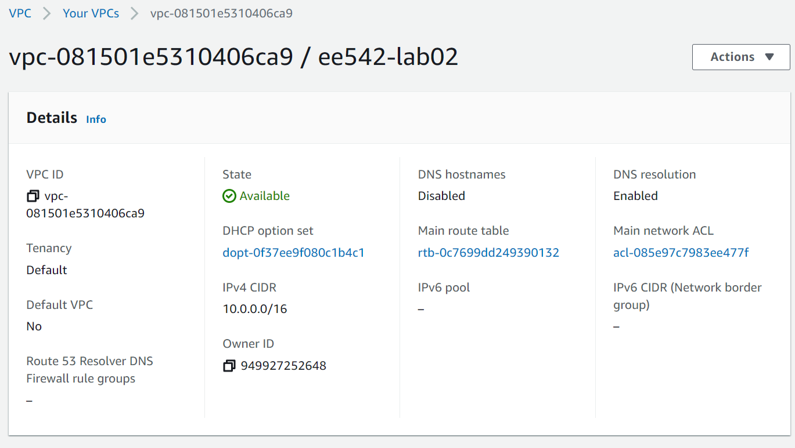
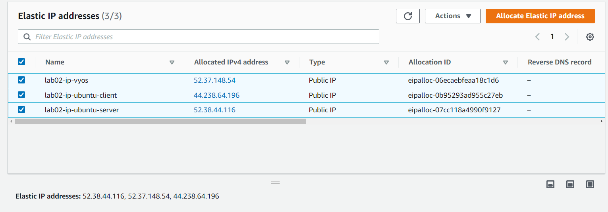
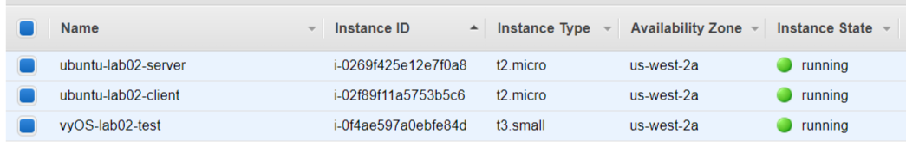
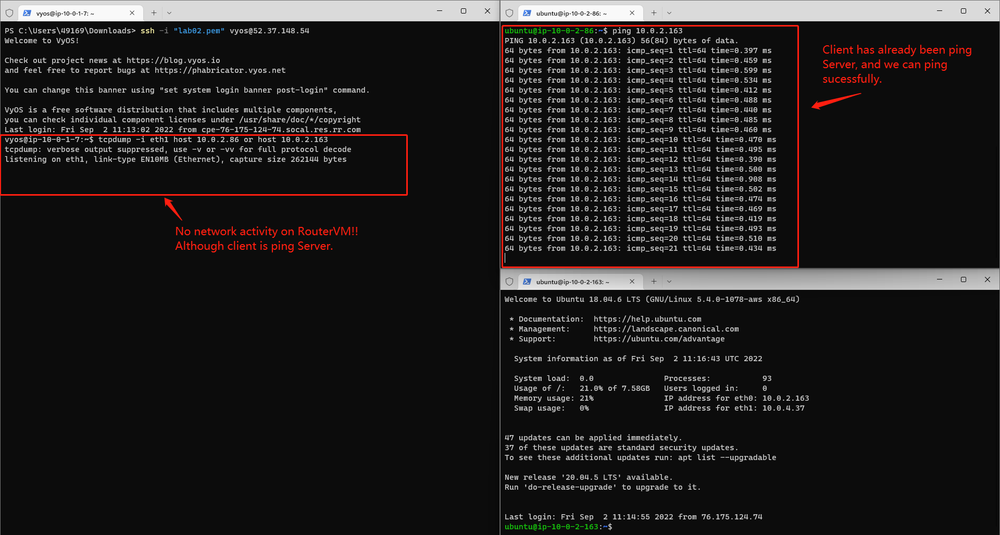
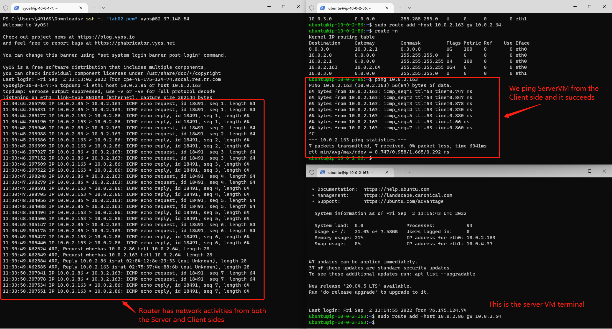
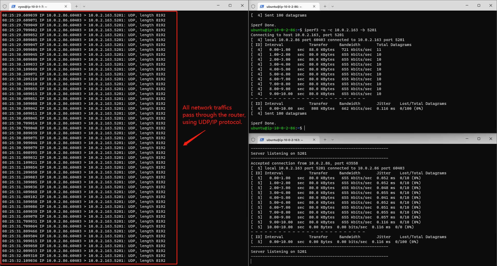

# EE542 - Lab02

### Building a Server-Router-Client topological model on AWS
---
#### Topics:

- Initializing Virual Private Cloud (VPC) service and EC2 instances on AWS
- Using AWS VPC services and EC2 instances to build a Server-Router-Client network model
- Exploring to configure routing settings for different components in Computer Networks
- Learning to install iPerf and iPerf3 tools on Linux to measure the bandwidths of computers' network access

#### Author: [Boyang Xiao](https://www.linkedin.com/in/boyang-xiao-40b644225/)

- **USC id**:		3326-7302-74
- **Email**:		<a href="mailto:boyangxi@usc.edu">boyangxi@usc.edu</a>
- **Github**:	[here](https://github.com/SeanXiaoby)

#### Dev Environment:

- **AWS acount:** Free tier
- **Installed VM OS**: [vyOS 1.3](https://aws.amazon.com/marketplace/pp/prodview-o7dahbop7getw?sr=0-1&ref_=beagle&applicationId=AWSMPContessa), [Ubuntu 18.04 LTS](https://aws.amazon.com/marketplace/pp/prodview-pkjqrkcfgcaog?sr=0-1&ref_=beagle&applicationId=AWSMPContessa)

#### [Video Introductions]()

---
## Creating VPC and EC2 instances on AWS

### VPC configuration
Click on AWS VPC console and create a new VPC by clicking the button on the upper-right corner

Configurations for VPC (as shown in the following picture):
    - **Name**: ee542-lab02
    - **IPv4 CIDR**: 10.0.0.0/16
    - **Disable** IPv6 CIDR

Click on the subnets tab on the left side-bar. Add four subnets to the VPC, partitioning the IPv4 CIDR into four domains:
    - Subnet-1: 10.0.1.0/24
    - Subnet-2: 10.0.2.0/24
    - Subnet-3: 10.0.3.0/24
    - Subnet-4: 10.0.4.0/24




### Get Elastic IP addresses assigned by AWS
An [elastic ip](https://docs.aws.amazon.com/AWSEC2/latest/UserGuide/elastic-ip-addresses-eip.html) addresse is a static IPv4 address designed for dynamic cloud computing. An Elastic IP address is allocated to your AWS account, and is yours until you release it. 

Click the Elastic IP tab on the left side-bar. Allocate **three elastic ip addresses** for further use.

These three elastic ip addresses can be the public IPv4 addresses for the ServerVM, RouterVM and ClientVM, which can be used to access the open Internet by the virtual machines.

❗When the elastic ip addresses are associated with an EC2 instance, it will be billed a little amount of fee, even if the instance is closed. Please release the elastic ip addresses if they are not in use anymore to avoid more billings!!




### Create EC2 (Elastic computing clouds) instances 
[Amazon Elastic Compute Cloud (Amazon EC2)](https://docs.aws.amazon.com/AWSEC2/latest/UserGuide/concepts.html) provides scalable computing capacity in the Amazon Web Services (AWS) Cloud. Using Amazon EC2 eliminates your need to invest in hardware up front, so you can develop and deploy applications faster. You can use Amazon EC2 to launch as many or as few virtual servers as you need, configure security and networking, and manage storage. Amazon EC2 enables you to scale up or down to handle changes in requirements or spikes in popularity, reducing your need to forecast traffic.
  - Create one instance and install vyOS 1.3 in it as a RouterVM.
  - Create two instances and install Ubuntu 18.04 in them as a ClientVM and a ServerVM.



---

## Building a Server-Router-Client model on AWS

### Configure routing relations for EC2 instances
Configure two network interfaces for each instance, one for SSH access, the other for internal networks access.
  - The network interfaces which are connecting to the outside internet **should be associated with one of the elastic IP addresses** we got. The instance can use this interface to connect to the open Internet domains and can also be accessed by outside SSH clients.
  - The network interfaces which are used for internal communications should **share the same subnet domains** for three instances so that they can access to each other in this same subnet domains. Here, we chose 10.0.2.0/24 domain as the internal networks domain.

The mapping relations between each instance's network interfaces is shown below.

|Instance name  | OS |    Network interface #   | Subnet domain| Mapping to| Usage|
|---|----|----| ---| ---| --- |
|vyOS-lab02-router|vyOS 1.3| eth0| 10.0.1.0/24 | Elastic ip #1: lab02-ip-vyos| SSH access from outside|
|...    | ...   |eth1| 10.0.2.0/24| Client and Server VMs| Internal communications|
|Ubuntu-lab02-Client| Ubuntu 18.04| eth0 | 10.0.2.0/24| Router VM| Internal communications|
|...| ...| eth1| 10.0.3.0/24| Elastic ip #2: lab02-ip-client| SSH access from outside|
|Ubuntu-lab02-Server| Ubuntu 18.04| eth0 | 10.0.2.0/24| Router VM| Internal communications|
|...| ...| eth1| 10.0.4.0/24| Elastic ip #3: lab02-ip-server| SSH access from outside|

### Launch the instances and access them by SSH
Create and launch three instances and wait for them to be prepared. When the instances are ready and the elastic ip addresses are configured right, we should be able to ping these three elastic ip addresses well. [Here](https://networkappers.com/tools/ping-tool) is a little online Ping tool we can use to test that.

**Authentication:** When creating the instances, AWS should create a key pair for them. This is for authentication when logging into the instances, so we don't need to input user/passwd. This should be a [*.pem] file and please keep it safe on the local end.

Open three terminal windows on the local end. Enter the folder where the .pem file is, and input the following commond to *SSH* into the instances' OS:

```shell
ssh -i "lab02.pem" <OS name>@<ELastic ip address>
```

For example: If we want to *ssh* into the vyOS router vm, we can execute:
```shell
ssh -i "lab02.pem" vyos@52.37.148.54
```
Or if we want to *ssh* into the Server VM, we can :

```shell
ssh -i "lab02.pem" ubuntu@52.38.44.116
```
In this way, we can access and operate on the instances operating systems we created. 

⚠ **There is one thing we should be careful with:**

If the ELastic IP is associated with a eth1 interface of a instance, we may not be able to access to it through SSH, since the initialized Linux VM has no open& running eth1 interface but only has eth0. We can associate the elastic ip address with eth0 and get into the instance first. Than we open up eth1 and configure its IPv4 address as allocated by AWS and set the routing rules. We can refer to [this post](https://serverfault.com/questions/1066245/cannot-ssh-to-second-network-interface-in-ubuntu-20-04-on-ec2) to set the rules.

---

## Test networks connections for the model and set routing rules

#### Goal:
- Make these three Vms can connect with each other under the same subnet domain.
- Build the routing model: When Server and Client communicates with each other, the traffic should be like:
  - Server -> Router -> Client
  - Client -> Router -> Server
  
### Test Networks connection using Ping cmd and tcpdump cmd

[Tcpdump]() is a very useful tool on Linux which can help us to monitor TCP/UDP packets switching status through a host. We can open up tcpdump on vyOS router VM to monitor if there is any network in/out through the router:
```shell
tcpdump -i eth1 host <ServerVM eth0 IP address> or host <ClientVM eth0 IP address>
```

If we directly ping ServerVM on the client VM like below.
```shell
ping <Server eth0 IP address>
```
We can surely success because the ServerVM and ClientVM is under the same subnet and they can surely access each other. But we can also notice that there is no networks activity on the router machine, since the Server and CLient communicate with each other directly, but don't go through the router.




### Configure Routing relations on ServerVM and ClientVM

To make the networks between ServerVM and ClientVM passing through the RouterVM and be routed by the router, we should configure the Routing table on both the ServerVM and ClientVM. If we look into any one of these two 's routing table using:
```shell
route -n
```
We can find that there is no special routing info. All the networks are routed by default.
```shell
Kernel IP routing table
Destination     Gateway         Genmask         Flags Metric Ref    Use Iface
0.0.0.0         10.0.2.1        0.0.0.0         UG    100    0        0 eth0
10.0.2.0        0.0.0.0         255.255.255.0   U     0      0        0 eth0
10.0.2.1        0.0.0.0         255.255.255.255 UH    100    0        0 eth0
10.0.3.0        0.0.0.0         255.255.255.0   U     0      0        0 eth1
```

To be specifc, we should add a **Gateway** for the destination IP address on the both end:
- For the Client, the destination ip is Server's ip and the gateway is the Router's ip. 
- For the Server, the destination ip is the client's ip, and the gateway is the Router's ip.

For example, we execute this on the Client side:

```shell
sudo route add -host <ServerVM eth0 IP address> gw <RouterVM eth1 IP address>
```
And we execute this on the Server side:

```shell
sudo route add -host <ClientVM eth0 IP address> gw <RouterVM eth1 IP address>
```
Then we can find an extra rule on the routing table:
```shell
Kernel IP routing table
Destination     Gateway         Genmask         Flags Metric Ref    Use Iface
0.0.0.0         10.0.2.1        0.0.0.0         UG    100    0        0 eth0
10.0.2.0        0.0.0.0         255.255.255.0   U     0      0        0 eth0
10.0.2.1        0.0.0.0         255.255.255.255 UH    100    0        0 eth0
10.0.2.163      10.0.2.64       255.255.255.255 UGH   0      0        0 eth0
10.0.3.0        0.0.0.0         255.255.255.0   U     0      0        0 eth1
```

Then we Ping ServerVm from ClientVM again and monitor Router's networks activities. We can find that the Router has networks activities from both Server side and Client side, as shown in the picture below. And we can say that **the network communication has been configured as we expected.**

 


 ## Other Questions and Answers

**Q: How is amazon able to convert your public IP and reach your private IP on the interface?**

**Answer**: The elastic ip addresses are randomly assigned by AWS and AWS server actually works as a router when an elastic ip is allocated to the user. The AWS server will create a mapping table to route all the network traffic from the public internet from this elastic IP to the instances' private ip address.

**Q: Why SSH goes down if IP is changed on that interface**

**Answer**: When we use SSH to access an EC2 instance, we firstly connect to the elastic ip address associated with this instance, and AWS will route us from this elastic ip to the instance's private ip, then we can control the instance's OS. If we change any IP configurations on the console interface while SSH is still on, SSH connections will lose because we are actually changing the mapping table from the elastic ip to the instance and AWS will have errors routing the networks between us and the instances.


---

## Networks measurement with iPerf & iPerf3

[iPerf](https://iperf.fr/iperf-download.php) is a tool for network performance measurement and tuning. It is a cross-platform tool that can produce standardized performance measurements for any network. Iperf has client and server functionality, and can create data streams to measure the throughput between the two ends in one or both directions. Typical iperf output contains a time-stamped report of the amount of data transferred and the throughput measured.

### Install iPerf/iPerf3 on Ubuntu VMs

For either Client VM or Server VM: First, we enter root:

```shell
sudo su
```

If  we directly install iPerf/iPerf3, it will fail:

```shell
sudo apt-get install -y iperf
```

We should install some dependancies ahead:

```shell
apt-get install linux-tools-common
apt-get update
apt-get install linux-tools-generic linux-cloud-tools-generic
apt-get install linux-tools-5.4.0-77-generic
apt-get install linux-cloud-tools-5.4.0-77-generic
```

Then we install iPerf/iPerf3:

```shell
sudo apt-get install -y iperf
```

It may still fail, and we follow the instructions on the terminal:

```shell
--fix-broken install
```

If there is an error named "subprocess was killed by signal (Broken pipe)" or something like that, we can refer to [this post](https://stackoverflow.com/questions/72442108/dpkg-dep-error-paste-subprocess-was-killed-by-signalbroken-pipe-ubuntu-wsl2)(Btw, this dude literally saved my ass when installing the dumbasss iPerf😅) and excecute:

```shell
sudo dpkg -i --force-overwrite <PATH to the overwritten files>
sudo apt -f install
```

Find every file that is said to be overwritten on the terminal and fill them into the commands above. For example, on my virtual machines:

```shell
sudo dpkg -i --force-overwrite /var/cache/apt/archives/linux-azure-5.4-tools-5.4.0-1078_5.4.0-1078.81~18.04.1_amd64.deb
sudo dpkg -i --force-overwrite /var/cache/apt/archives/linux-gcp-5.4-tools-5.4.0-1078_5.4.0-1078.84~18.04.1_amd64.deb
sudo dpkg -i --force-overwrite  /var/cache/apt/archives/linux-gke-5.4-tools-5.4.0-1078_5.4.0-1078.84~18.04.1_amd64.deb
sudo dpkg -i --force-overwrite  /var/cache/apt/archives/linux-oracle-5.4-tools-5.4.0-1078_5.4.0-1078.86~18.04.1_amd64.deb
sudo apt -f install
```

Then we can install all we want:

```shell
sudo apt-get install -y iperf
sudo apt-get install -y iperf3
```

### Measure the networks using iPerf3

First, we configure the **ServerVM** as an iPerf3 server:

```shell
iPerf3 -s
```

Note the portnum assigned to the Server and use iPerf3 on the **Client VM** to communicate with the Server:

```shell
iperf3 -u -c 10.0.2.163 -b <portnum>
```

The Client VM will send/receive an amount of packets with the Server and this process will last for 10 secs. Both ends will show the info:

```shell
Connecting to host 10.0.2.163, port 5201
[  4] local 10.0.2.86 port 35417 connected to 10.0.2.163 port 5201
[ ID] Interval           Transfer     Bandwidth       Total Datagrams
[  4]   0.00-1.00   sec  88.0 KBytes   721 Kbits/sec  11
[  4]   1.00-2.00   sec  80.0 KBytes   655 Kbits/sec  10
[  4]   2.00-3.00   sec  80.0 KBytes   655 Kbits/sec  10
[  4]   3.00-4.00   sec  80.0 KBytes   655 Kbits/sec  10
[  4]   4.00-5.00   sec  80.0 KBytes   655 Kbits/sec  10
[  4]   5.00-6.00   sec  80.0 KBytes   655 Kbits/sec  10
[  4]   6.00-7.00   sec  80.0 KBytes   655 Kbits/sec  10
[  4]   7.00-8.00   sec  80.0 KBytes   655 Kbits/sec  10
[  4]   8.00-9.00   sec  80.0 KBytes   655 Kbits/sec  10
[  4]   9.00-10.00  sec  80.0 KBytes   655 Kbits/sec  10
- - - - - - - - - - - - - - - - - - - - - - - - -
[ ID] Interval           Transfer     Bandwidth       Jitter    Lost/Total Datagrams
[  4]   0.00-10.00  sec   808 KBytes   662 Kbits/sec  0.060 ms  0/100 (0%)
[  4] Sent 100 datagrams
```

We can then read the Bandwidth, jitter and datagrams loss from the measurement results. If we open tcpdump on the router, we can also find that all the networks traffics pass through the router and they are all using UDP/IP protocol.

 

## Add delay/loss to the virtual machines and measure the networks

To emulate the network delay and network loss scenarios, we can manually add some delay and loss to the ip config and explore the iPerf measurement results again.

**First**, we add delay to both the Server and the Client with the following commands:

```shell
sudo tc qdisc add dev eth0 root netem delay 100ms
```
And we do the measurements again. The results are as following:

```shell
Connecting to host 10.0.2.163, port 5201
[  4] local 10.0.2.86 port 55948 connected to 10.0.2.163 port 5201
[ ID] Interval           Transfer     Bandwidth       Total Datagrams
[  4]   0.00-1.00   sec  80.0 KBytes   655 Kbits/sec  10
[  4]   1.00-2.00   sec  80.0 KBytes   655 Kbits/sec  10
[  4]   2.00-3.00   sec  80.0 KBytes   655 Kbits/sec  10
[  4]   3.00-4.00   sec  80.0 KBytes   655 Kbits/sec  10
[  4]   4.00-5.00   sec  80.0 KBytes   655 Kbits/sec  10
[  4]   5.00-6.00   sec  80.0 KBytes   655 Kbits/sec  10
[  4]   6.00-7.00   sec  80.0 KBytes   655 Kbits/sec  10
[  4]   7.00-8.00   sec  80.0 KBytes   655 Kbits/sec  10
[  4]   8.00-9.00   sec  80.0 KBytes   655 Kbits/sec  10
[  4]   9.00-10.00  sec  80.0 KBytes   655 Kbits/sec  10
- - - - - - - - - - - - - - - - - - - - - - - - -
[ ID] Interval           Transfer     Bandwidth       Jitter    Lost/Total Datagrams
[  4]   0.00-10.00  sec   800 KBytes   655 Kbits/sec  0.143 ms  0/99 (0%)
[  4] Sent 99 datagrams
```

We can find that, the bandwidth has not changed at all. But the jitter can be twice as much. **Therefore**, the networks delay can influence the jitter but not the bandwidth.

**Then**, we remove the delay and add loss to both virtual machines (note that this time we use **change** command but not **add**):

```shell
sudo tc qdisc change dev eth0 root netem delay 0ms loss 10%
```

And we get the measurements results again:

```shell
Connecting to host 10.0.2.163, port 5201
[  4] local 10.0.2.86 port 35747 connected to 10.0.2.163 port 5201
[ ID] Interval           Transfer     Bandwidth       Total Datagrams
[  4]   0.00-1.00   sec  88.0 KBytes   721 Kbits/sec  11
[  4]   1.00-2.00   sec  80.0 KBytes   655 Kbits/sec  10
[  4]   2.00-3.00   sec  80.0 KBytes   655 Kbits/sec  10
[  4]   3.00-4.00   sec  80.0 KBytes   655 Kbits/sec  10
[  4]   4.00-5.00   sec  80.0 KBytes   655 Kbits/sec  10
[  4]   5.00-6.00   sec  80.0 KBytes   655 Kbits/sec  10
[  4]   6.00-7.00   sec  80.0 KBytes   655 Kbits/sec  10
[  4]   7.00-8.00   sec  80.0 KBytes   655 Kbits/sec  10
[  4]   8.00-9.00   sec  80.0 KBytes   655 Kbits/sec  10
[  4]   9.00-10.00  sec  80.0 KBytes   655 Kbits/sec  10
- - - - - - - - - - - - - - - - - - - - - - - - -
[ ID] Interval           Transfer     Bandwidth       Jitter    Lost/Total Datagrams
[  4]   0.00-10.00  sec   808 KBytes   662 Kbits/sec  0.084 ms  10/100 (10%)
[  4] Sent 100 datagrams
```

As we expected, the jitter gets back to normal because we set the delay back to 0ms. And the datagrams loss gets up to 10%, because we set the loss to be 10%. As always, the bandwidth is still the same.

**Next**, we delete the configurations we set just now:

```shell
sudo tc qdisc del dev eth0 root
```

And we set another scenario: we limit the networks rate to 100mbit, latency to 1 ms and burst 9015:

```shell
sudo tc qdisc add dev eth0 root tbf rate 100mbit latency 1ms burst 9015
```

We measure again and the results:

```shell
Connecting to host 10.0.2.163, port 5201
[  4] local 10.0.2.86 port 45441 connected to 10.0.2.163 port 5201
[ ID] Interval           Transfer     Bandwidth       Total Datagrams
[  4]   0.00-1.00   sec  88.0 KBytes   721 Kbits/sec  11
[  4]   1.00-2.00   sec  80.0 KBytes   655 Kbits/sec  10
[  4]   2.00-3.00   sec  80.0 KBytes   655 Kbits/sec  10
[  4]   3.00-4.00   sec  80.0 KBytes   655 Kbits/sec  10
[  4]   4.00-5.00   sec  80.0 KBytes   655 Kbits/sec  10
[  4]   5.00-6.00   sec  80.0 KBytes   655 Kbits/sec  10
[  4]   6.00-7.00   sec  80.0 KBytes   655 Kbits/sec  10
[  4]   7.00-8.00   sec  80.0 KBytes   655 Kbits/sec  10
[  4]   8.00-9.00   sec  80.0 KBytes   655 Kbits/sec  10
[  4]   9.00-10.00  sec  80.0 KBytes   655 Kbits/sec  10
- - - - - - - - - - - - - - - - - - - - - - - - -
[ ID] Interval           Transfer     Bandwidth       Jitter    Lost/Total Datagrams
[  4]   0.00-10.00  sec   808 KBytes   662 Kbits/sec  0.071 ms  0/100 (0%)
[  4] Sent 100 datagrams
```

We can find that all the results remain the same, because the existing bandwidth is way lower than the limitaions we set, so the limitations do not affect the results. If we set the rate to be really small, and we will see that the data transferring rate will desend fast.

**Last**, we set speed for the instance:
```shell
ubuntu@ip-10-0-2-86:~$ sudo ethtool -s eth0 speed 10
Cannot get current device settings: Operation not supported
  not setting speed
```

We can find that AWS does not allow us to excecute this operation, because every instance has a fixed bandwidth resource and it is not allowed to modify.

### Add delay / loss on the Router and measure again

Let's do the same thing on the & only on **router**, launch the Server and Client using iPerf3 again and see what will happen.

**First**, we add 100ms delay for the router. 

❗Note that: Router uses eth1 as the internal network interface. **We should add delay to eth1 but not eth0**!!!

Here are the results:

```shell
Connecting to host 10.0.2.163, port 5201
[  4] local 10.0.2.86 port 59975 connected to 10.0.2.163 port 5201
[ ID] Interval           Transfer     Bandwidth       Total Datagrams
[  4]   0.00-1.00   sec  80.0 KBytes   655 Kbits/sec  10
[  4]   1.00-2.00   sec  80.0 KBytes   655 Kbits/sec  10
[  4]   2.00-3.00   sec  80.0 KBytes   655 Kbits/sec  10
[  4]   3.00-4.00   sec  80.0 KBytes   655 Kbits/sec  10
[  4]   4.00-5.00   sec  80.0 KBytes   655 Kbits/sec  10
[  4]   5.00-6.00   sec  80.0 KBytes   655 Kbits/sec  10
[  4]   6.00-7.00   sec  80.0 KBytes   655 Kbits/sec  10
[  4]   7.00-8.00   sec  80.0 KBytes   655 Kbits/sec  10
[  4]   8.00-9.00   sec  80.0 KBytes   655 Kbits/sec  10
[  4]   9.00-10.00  sec  80.0 KBytes   655 Kbits/sec  10
- - - - - - - - - - - - - - - - - - - - - - - - -
[ ID] Interval           Transfer     Bandwidth       Jitter    Lost/Total Datagrams
[  4]   0.00-10.00  sec   800 KBytes   655 Kbits/sec  0.059 ms  0/99 (0%)
[  4] Sent 99 datagrams
```

We can find that the results are similar as we got from the Server/Client settings: **the Jitter can be higher due to the higher delay.** If we look into the info from the Server end, we can even find the jitter varies a lot within these 10 secs and the delay can really affect the network stablily.

**Then** we set Router delay to 0ms and loss to 10%. Here are the results:

```shell
Connecting to host 10.0.2.163, port 5201
[  4] local 10.0.2.86 port 35957 connected to 10.0.2.163 port 5201
[ ID] Interval           Transfer     Bandwidth       Total Datagrams
[  4]   0.00-1.00   sec  88.0 KBytes   721 Kbits/sec  11
[  4]   1.00-2.00   sec  80.0 KBytes   655 Kbits/sec  10
[  4]   2.00-3.00   sec  80.0 KBytes   655 Kbits/sec  10
[  4]   3.00-4.00   sec  80.0 KBytes   655 Kbits/sec  10
[  4]   4.00-5.00   sec  80.0 KBytes   655 Kbits/sec  10
[  4]   5.00-6.00   sec  80.0 KBytes   655 Kbits/sec  10
[  4]   6.00-7.00   sec  80.0 KBytes   655 Kbits/sec  10
[  4]   7.00-8.00   sec  80.0 KBytes   655 Kbits/sec  10
[  4]   8.00-9.00   sec  80.0 KBytes   655 Kbits/sec  10
[  4]   9.00-10.00  sec  80.0 KBytes   655 Kbits/sec  10
- - - - - - - - - - - - - - - - - - - - - - - - -
[ ID] Interval           Transfer     Bandwidth       Jitter    Lost/Total Datagrams
[  4]   0.00-10.00  sec   808 KBytes   662 Kbits/sec  0.087 ms  11/100 (11%)
```

Same, the results from iPerf3 say that the average loss comes up to approximately 10%, as we expected.

**Next**, we limit the networks rate to 100mbit, latency to 1 ms and burst 9015. Here are the results:

```shell
Connecting to host 10.0.2.163, port 5201
[  4] local 10.0.2.86 port 54763 connected to 10.0.2.163 port 5201
[ ID] Interval           Transfer     Bandwidth       Total Datagrams
[  4]   0.00-1.00   sec  88.0 KBytes   721 Kbits/sec  11
[  4]   1.00-2.00   sec  80.0 KBytes   655 Kbits/sec  10
[  4]   2.00-3.00   sec  80.0 KBytes   655 Kbits/sec  10
[  4]   3.00-4.00   sec  80.0 KBytes   655 Kbits/sec  10
[  4]   4.00-5.00   sec  80.0 KBytes   655 Kbits/sec  10
[  4]   5.00-6.00   sec  80.0 KBytes   655 Kbits/sec  10
[  4]   6.00-7.00   sec  80.0 KBytes   655 Kbits/sec  10
[  4]   7.00-8.00   sec  80.0 KBytes   655 Kbits/sec  10
[  4]   8.00-9.00   sec  80.0 KBytes   655 Kbits/sec  10
[  4]   9.00-10.00  sec  80.0 KBytes   655 Kbits/sec  10
- - - - - - - - - - - - - - - - - - - - - - - - -
[ ID] Interval           Transfer     Bandwidth       Jitter    Lost/Total Datagrams
[  4]   0.00-10.00  sec   808 KBytes   662 Kbits/sec  0.031 ms  0/100 (0%)
[  4] Sent 100 datagrams
```

**Same**, it does not affect the networks at all, as expected.

#### Conclusion:

- Either we add delay / loss / rate limit on the Server, Client or Router end, the network measurement results can be similar. If we add to them at the same time, the limit of network can be the bottleneck among these three components.
- Delay: affect the network connections' stability and add jitters.
- Loss: affect the datagrams loss rate.
- Rate limit: affect the bandwidth.

---

## The End

This concludes the whole network emulations on AWS. We can do more on AWS, such as building internal networks structures based on these topological relations, or building some CDN servers or machine learning computing servers and using parallel computing on AWS. Anyway, this way to build a network is pretty fun!

If you have any concerns, please contact me at <a href="mailto:boyangxi@usc.edu">boyangxi@usc.edu</a> ❤

*Fight on Trojans!*